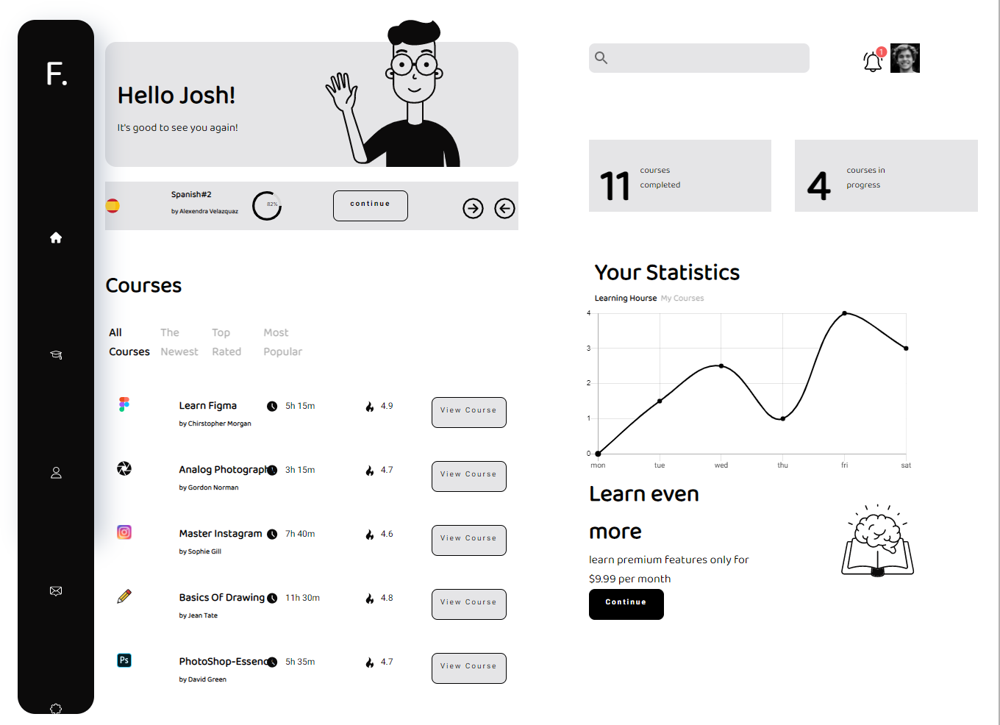

# Ed Tech Landing Page

## note : After Launching the demo, please refresh once if found unresponsive.

## Screenshot
<br>

# Tech Used
### 1.React
### 2.React Hooks
### 3.Context Api

# Features
### 1.Responsive
### 2.Progressive Web App ( Works offline + we can add it to home screen)
### 3.Minimilistic Ui

## Installation

```diff
+ npm install
+ npm start
+ it will run on your machine(localhost).
```

## Contributing
Pull requests are welcome. For major changes, please open an issue first to discuss what you would like to change.


## Live demo
[LIVE](https://whiteblackjr.netlify.com)

## License
[MIT](https://choosealicense.com/licenses/mit/)

  
